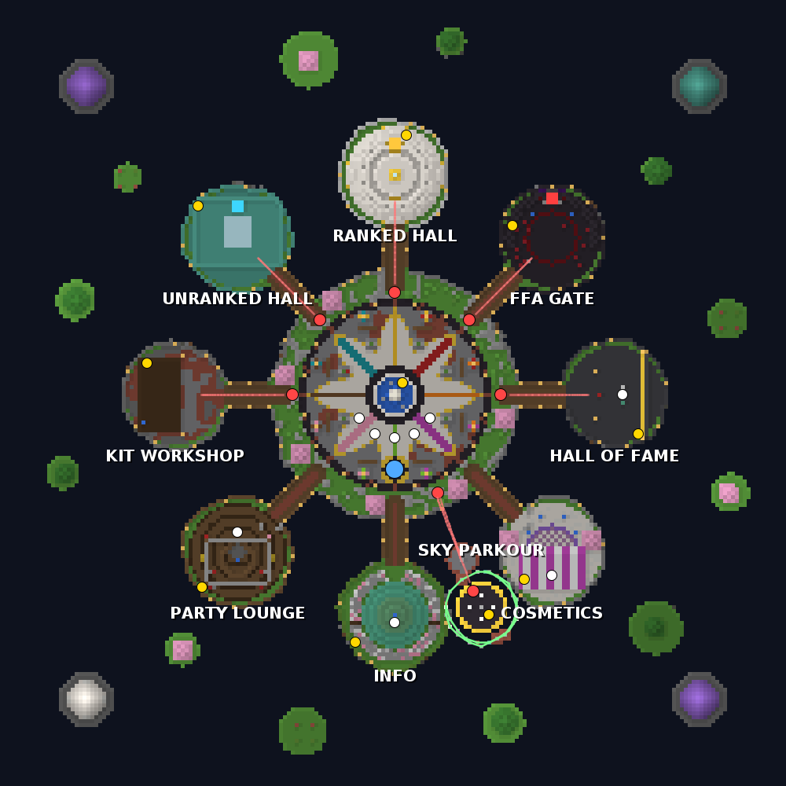
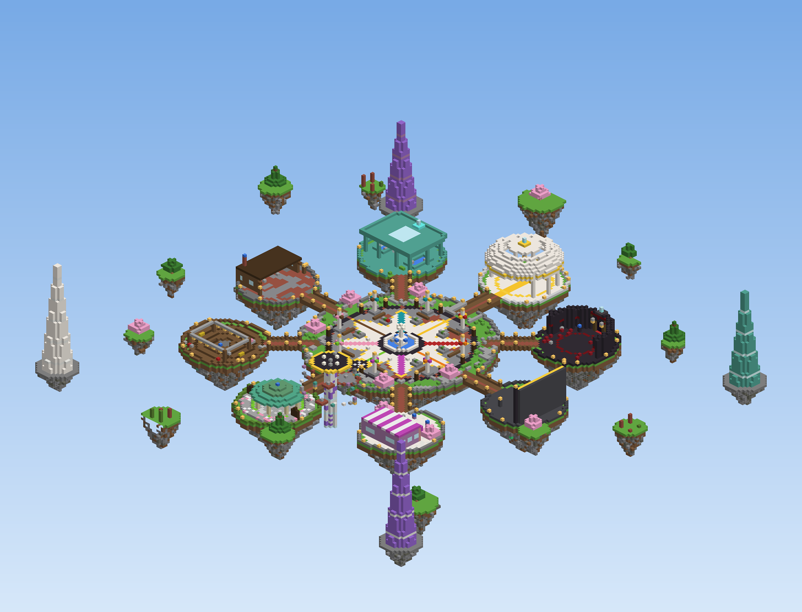

# PvP Practice Network

A Minemen Club / PvP.land style practice server for **Paper 1.21.11** (Java 21), split into four plugins built
from one Maven project:

| Plugin | What it does |
|--------|--------------|
| **PvPCore** | Shared services: async SQLite/MySQL storage, profiles and settings, ranks (+ LuckPerms), kits and per-player layouts, knockback profiles, combat rules, parties, arena templates with pooled instancing, sidebars and tab list, chat, moderation, cosmetics, CPS/reach alerts, ELO, stats, leaderboards |
| **PvPLobby** | A generated floating hub (or your own imported map) with player NPCs, walk-in portals, launch pads, a sky parkour, hidden eggs, a leaderboard wall, ambient particles, tips and announcements; protection, double jump, hotbar, menus and kit editor |
| **PvPDuels** | 1v1/2v2 ranked and unranked queues with a widening ELO window, matches with countdown, rounds, kit rules, results and inventory viewer, `/duel` requests, rematches, party fights, spectating |
| **PvPFFA** | Ranked and unranked FFA arenas with instant respawn, killstreaks, kill rewards, safe zones and combat-log punishment |

The architecture is described in [docs/ARCHITECTURE.md](docs/ARCHITECTURE.md), design choices in
[DECISIONS.md](DECISIONS.md), and ideas for later in [TODO.md](TODO.md).

---

## Quick start

Requirements: **Java 21+**, **Maven 3.9+**. Internet access to `repo.papermc.io` (build) and `fill.papermc.io` (start script).

```bash
mvn clean package          # builds the plugins and copies them to server/plugins/
cd server
./start.sh                 # Windows: start.bat   (optional argument: heap size, e.g. ./start.sh 10G)
```

`start.sh` downloads the latest Paper 1.21.11 build and checks its SHA-256. It also **accepts the Minecraft EULA
on your behalf** (running it means you agree to https://aka.ms/MinecraftEULA) and starts Paper with Aikar's G1 flags.
Environment overrides: `MC_VERSION`, `MEMORY`, `UPDATE_PAPER=1`, `JAVA`.

The `server/` folder already contains tuned configs:

* `server.properties`: flat world, view distance 6, simulation distance 4, 250 slots, allow-flight for knockback.
* `bukkit.yml`, `spigot.yml`: no mob spawning, reduced activation and tracking ranges, player data saving off.
* `config/paper-*.yml`: no player collisions, nether off, Alternate Current redstone, pots ignore thrower
  momentum, anti-xray off.

It also has default copies of every plugin config in `plugins/PvP*/`.

On first start PvPCore generates 21 themed arenas (see [Arenas](#arenas)) and ships 12 kits (see [Kits](#kits)),
and PvPLobby builds the lobby hub in its own `pvp_lobby` world (see [The lobby](#the-lobby)). The server is
playable immediately: join, click an NPC or walk into a portal, and fight.

### First steps as an admin

1. `/op <you>` (or `/rank set <you> owner`).
2. Walk around the hub. `/lobby info` shows what it holds; `/lobby set ...` moves things around.
3. Optional: replace the hub with your own map ([Importing a custom lobby](#importing-a-custom-lobby)).
4. Add your own arenas: build them in game ([Adding arenas](#adding-arenas)) or import downloaded maps
   ([Importing arenas](#importing-arenas)). Tune knockback with `/kb`.

### Useful build targets

| Command | Result |
|---------|--------|
| `mvn clean package` | Four jars in `*/target/` and copied to `server/plugins/` (unit tests included) |
| `mvn test` | Unit and SQLite integration tests (ELO, parties, queue matching, repositories...) |
| `mvn -Psmoke verify` | Also boots the real jars inside MockBukkit and plays 42 end-to-end scenarios (see below) |
| `... -Dpvp.test.mysql.host=127.0.0.1 -Dpvp.test.mysql.username=u -Dpvp.test.mysql.password=p` | Adds the MySQL/MariaDB runs: the repository contract and a full ranked match on the server (`-Dpvp.test.mysql.database`, default `practice_test`; `-Dpvp.test.mysql.type=MARIADB` to test that setting) |

The smoke scenarios cover:
- Boot, lobby join and hotbar, and clean shutdown mid-match.
- Ranked 1v1 with ELO saved to the database, and the ranked 2v2 queue with team ELO.
- Kit rules: sumo void falls, boxing's 100-hit win, and bridge goals with the build limit and block rollback.
- `/duel` requests, rematch, and the post-match inventory viewer.
- Party split, party FFA and party-vs-party fights.
- Spectators, the kit editor layout carrying into matches, and disconnect forfeits with a clean reconnect.
- Duplicate queueing, FFA death and combat logging, the safe zone, and creating an arena in-game.
- A boot check of the content: every kit and arena loads with no warning, every kit's real items are checked
  (enchant levels, potion types, 8-minute Speed II), every kit plays on an arena made for it, arena rotation, and
  every arena pastes with standable spawns.
- Kit rules: soup healing and spleef digging; importing a `.schem` with marker signs and playing on it; loading a
  world folder.
- Leaderboard holograms, moderation (freeze, vanish, report, warn, tempban, history, unban) and private messages.
- The lobby: joining onto the generated hub (world rules, border, welcome title, tips bar, no warnings), every
  NPC's action and invulnerability, live queue counts on holograms, the ranked portal and the FFA gate, every
  launch pad, void rescue, a full parkour run with checkpoints, falls and best times, eggs and their reward,
  clickable blocks, protection, the rotating leaderboard wall, `/lobby set`, `/lobby reload`, `/pvpadmin reload`,
  `/lobby regenerate`, importing a schematic with sign tags and a world folder, and choosing lobby cosmetics.

---

## Gameplay overview

* **Lobby**: a floating hub with NPCs, portals and pads that queue you, a sky parkour and hidden eggs (see
  [The lobby](#the-lobby)), plus the hotbar with Unranked, Ranked, FFA, Party, Spectate, Leaderboards, Kit Editor,
  Stats and Settings. Players take no damage or hunger and are rescued from the void. Double jump can be toggled
  per player. The sidebar and tab list show live online, fighting and queued counts and the area you are in.
* **Queues**: pick a kit in the queue menu. Ranked pairs players whose ELO difference fits inside *both* players'
  search windows, which start at ±50 and grow by 25 every 5 s (configurable). Party leaders with 2 members
  queue 2v2. Solo players can also queue 2v2 and are paired into teams.
* **Matches**: an arena copy is taken from a pool, players are frozen for a 5 s countdown, then fight.
  Deaths are "fake deaths": no death screen. Results show ELO changes, clickable inventory buttons (final
  inventory, health, potions left, hits, longest combo) and a **[REMATCH]** button, then everyone returns to
  the lobby.
* **Kits** (in `kits.yml`): 12 kits with their own rules, see [Kits](#kits).
* **FFA**: `/ffa` or the hotbar. Instant respawn with 2 s spawn protection, killstreak rewards, a spawn safe zone
  that combat-tagged players can't re-enter, and blocked commands while tagged. Logging out in combat counts as a
  death and credits the last attacker. Ranked FFA arenas change a per-kit FFA rating.
* **Parties**: `/party invite`. The leader can queue 2v2, split the party into two teams, start a party FFA, or
  challenge another party.
* **Spectating**: `/spectate <player>` or the Spectate menu. Spectators are invisible to fighters, can fly, and
  get a teleport compass and a leave item.

### Kits

Every kit plays 1.8-style (no attack cooldown, no sweeping) with the loadout and rules practice servers use. Menus
show each kit's description; players can rearrange any editable kit in the kit editor.

| Kit | Loadout | Rules | Arenas |
|-----|---------|-------|--------|
| **NoDebuff** | Diamond Prot IV / Unbreaking III (Feather Falling IV boots), Sharpness III sword, 16 pearls, hotbar and inventory of splash Instant Health II, three Speed II (8:00) potions, steak | no hunger, no natural regen, 15 s pearl cooldown | standard |
| **Debuff** | as NoDebuff plus 2 splash Slowness and 2 splash Poison, fewer health pots | as NoDebuff | standard |
| **Gapple** | Diamond Prot IV, Sharpness V, 64 god apples, Speed II and Strength II (8:00), spare armour set | no natural regen | standard |
| **Combo** | Unbreakable Diamond Prot IV, Sharpness II, 64 god apples, Speed II | **no hit delay**, juggling knockback (`combo` profile), no fall damage | standard |
| **BuildUHC** | Diamond/iron Prot II mix, Sharpness III, rod, Power III bow + 64 arrows, 2 water + 2 lava buckets, 128 cobble, 64 planks, 6 golden apples + 3 golden heads, tools | build (only placed blocks break, map resets), no natural regen | build |
| **Classic** | Iron armour, iron sword, rod, bow + 24 arrows, 3 golden apples | 1.8 natural regen | standard |
| **Sumo** | nothing | no damage, lose by falling off or touching water | sumo |
| **Boxing** | nothing (fists), Speed II | no damage, first to **100 hits** wins, no health display | boxing |
| **Bridge** | Team-dyed leather, iron sword, bow + 1 arrow (comes back 3.5 s after each shot), pickaxe, 128 team-coloured terracotta, 8 golden apples | **first to 5 goals**, deaths respawn at base, blocks only inside the arena's build area | bridge |
| **Soup** | Iron armour, Sharpness I, Speed II, inventory of mushroom stew | right-click soup heals 3.5 hearts instantly, no natural regen | standard |
| **Archer** | Leather Prot II, Power II / Punch I / Infinity bow | never on Nether Keep (too cramped) | standard |
| **Spleef** | Efficiency V diamond shovel | only snow can be broken, no damage, last one standing | spleef |

`kits.yml` is versioned: when an update ships new kit defaults, your old file is kept as `kits.yml.v<N>.bak`.
Saved kit-editor layouts reset automatically when a kit's items change.

### Arenas

21 arenas are generated from code on first start (no schematic downloads), each with its own theme, lighting,
borders and barriers:

| Type (tag) | Arenas |
|------------|--------|
| Open fights (`standard`) | **Colosseum** (sandstone bowl, pillars, stepped dais), **Mossy Ruins** (hills, broken walls, fallen arch, trees), **Frozen Lake** (snow drifts, ice pond, ice spikes, spruces), **Nether Keep** (raised walkways, basalt pillars, towers, lava moat), **Sky Temple** (floating quartz temple, balconies, pools) |
| Sumo (`sumo`) | **Sumo Dojo** (13x13 over water, torii gates), **Lotus Pond** (radius 8), **Sky Ring** (radius 9 over the void), **Islet** (radius 6.5, tight) |
| Boxing (`boxing`) | **Championship Ring** (chain ropes, bleachers, lighting rig), **Old Gym** (fence ropes, punching bags), **Rooftop** (neon, glass rails) |
| BuildUHC (`build`) | **Plains**, **Taiga**, **Mesa**: 81x81 terrain with hills, trees, a pond and a lava pocket, build limit 34 |
| Bridge (`bridge`) | **The Bridge**, **Sunken Ruins** (water below), **Nether Crossing**: two bases, goal pits, middle island, build area around the bridge |
| Spleef (`spleef`) | **Snow Bowl**, **Snow Layers** (three stacked floors), **Lava Pit** |

A match picks uniformly at random among the arenas its kit allows (`arena-tags`, an `arenas:` whitelist and an
`arena-blacklist`), and `/duel` lets the challenger choose one. Deleted built-in arenas stay deleted;
`/arena generate <name|all>` recreates them. Copies are pooled in a void world, rolled back block by block after
each match, and pre-warmed in the background, so matches never wait behind startup pasting.

---

## Commands

All commands have tab completion. Player commands are granted by default through `default: true` permissions.

### Players

| Command | Aliases | Description | Permission |
|---------|---------|-------------|------------|
| `/spawn` | `/hub`, `/l` | Return to the lobby (leaves queue/FFA/spectating/parkour) | `pvp.command.spawn` |
| `/lobby` | | Same as `/spawn` for players; admins get the [lobby commands](#lobby-commands) | `pvp.command.spawn` |
| `/queue join <kit> <ranked\|unranked> [1v1\|2v2]` | `/q` | Join a queue (also `/queue ranked`, `/queue unranked`, `/queue leave`) | `pvp.command.queue` |
| `/duel <player> [kit]` | `/1v1`, `/fight`, `/challenge` | Challenge a player (kit, arena, rounds menus) | `pvp.command.duel` |
| `/duel accept\|deny <player>` | | Answer a duel request | `pvp.command.duel` |
| `/rematch` | | Rematch your last opponent | `pvp.command.duel` |
| `/leave` | `/forfeit`, `/ff` | Forfeit a match, leave a queue or stop spectating | `pvp.command.leave` |
| `/spectate [player\|leave]` | `/spec`, `/watch` | Spectate a match or open the live match list | `pvp.command.spectate` |
| `/inventory <id>` | `/inv` | Post-match inventory viewer (used by chat buttons) | `pvp.command.inventory` |
| `/ffa [arena\|leave\|list]` | | Join or leave FFA | `pvp.command.ffa` |
| `/party <sub>` | `/p` | `create, invite, accept, join, leave, kick, promote, disband, open, close, info, chat, fight` | `pvp.command.party` |
| `/pc <message>` | `/partychat` | Party chat | `pvp.command.party` |
| `/kiteditor` | `/editkit` | Edit kit layouts | `pvp.command.kiteditor` |
| `/stats [player]` | `/profile` | Per-kit statistics | `pvp.command.stats` |
| `/leaderboard` | `/lb`, `/top` | Leaderboards menu | `pvp.command.leaderboard` |
| `/settings` | `/options`, `/prefs` | Scoreboard, duel requests, PMs, spectators, lobby players, cosmetics, join messages, double jump, time of day | `pvp.command.settings` |
| `/cosmetics` | | Kill effects, death animations, join messages, lobby trails and join effects | `pvp.command.cosmetics` |
| `/msg <player> <message>` | `/tell`, `/w`, `/m`, `/pm` | Private message | `pvp.command.msg` |
| `/reply <message>` | `/r` | Reply | `pvp.command.msg` |
| `/ignore <player\|list>`, `/unignore <player>` | | Ignore list (also blocks PMs, duels, invites) | `pvp.command.ignore` |
| `/report <player> <reason>` | | Report to staff (cooldown) | `pvp.command.report` |

### Staff and moderation

Durations: `30s`, `10m`, `12h`, `7d`, `2w`, `1mo`, `1y`, combinations like `1d12h`, or `perm`. Add `-s` to keep a punishment silent.

| Command | Description | Permission |
|---------|-------------|------------|
| `/ban <player> [reason] [-s]` | Permanent ban | `pvp.moderation.ban` |
| `/tempban <player> <duration> [reason] [-s]` | Temporary ban (`/tban`) | `pvp.moderation.tempban` |
| `/unban <player> [reason]` | Remove ban (`/pardon`) | `pvp.moderation.unban` |
| `/mute`, `/tempmute`, `/unmute` | Mutes (same syntax) | `pvp.moderation.mute` / `.tempmute` / `.unmute` |
| `/kick <player> [reason]` | Kick | `pvp.moderation.kick` |
| `/warn <player> <reason>` | Warning (title + record) | `pvp.moderation.warn` |
| `/history <player>` | Punishment history (`/punishments`) | `pvp.moderation.history` |
| `/freeze <player>` | Freeze for a screenshare (`/ss`) | `pvp.staff.freeze` |
| `/vanish` | Vanish (`/v`) | `pvp.staff.vanish` |
| `/staffchat [message]` | Staff chat or toggle (`/sc`) | `pvp.staff.chat` |
| `/reports` | Recent reports | `pvp.staff.reports` |
| `/alerts` | Toggle CPS/reach alerts | `pvp.staff.alerts` |
| `/socialspy` | See private messages (`/spy`) | `pvp.staff.socialspy` |
| `/chat <slow <s>\|clear\|mute\|unmute>` | Chat moderation | `pvp.chat.admin` |

### Administration

| Command | Description | Permission |
|---------|-------------|------------|
| `/pvpadmin reload` | Reload every config of all four plugins | `pvp.admin.reload` |
| `/pvpadmin status` | TPS, memory, player states, arena pool | `pvp.admin` |
| `/pvpadmin setelo <player> <kit> <elo>` / `resetstats <player> [kit]` | Stats admin | `pvp.admin.stats` |
| `/pvpadmin leaderboards` | Refresh leaderboards now | `pvp.admin` |
| `/pvpadmin kit <kit> [player]` | Give a kit's items for inspection (`/spawn` resets) | `pvp.admin.kits` |
| `/kb list\|info\|set\|create\|delete\|default\|kit` | Edit knockback profiles live | `pvp.admin.kb` |
| `/rank set <player> <rank>`, `/rank list`, `/rank info <player>` | Built-in ranks (`/setrank`) | `pvp.admin.rank` |
| `/arena ...` | Arena authoring and pool control (see below) | `pvp.admin.arena` |
| `/matches [cancel <player>]` | List or cancel live matches | `pvp.admin.matches` |
| `/setspawn` | Set the lobby spawn (same as `/lobby set spawn`) | `pvp.admin.lobby` |
| `/lobby <sub>` | Rebuild, import and edit the lobby: see [Lobby commands](#lobby-commands) | `pvp.admin.lobby` |
| `/lbholo create <id> <kit\|global> <stat>`, `delete`, `list`, `reload` | Leaderboard holograms | `pvp.admin.lobby` |
| `/fly` | Lobby flight | `pvp.lobby.fly` |

### Other permissions

| Permission | Default | Meaning |
|------------|---------|---------|
| `pvp.staff` | op | Staff member: includes chat, alerts, vanish, see-vanished, freeze, reports, socialspy, kick/warn/mute/tempban/history |
| `pvp.staff.vanish.see` | op | See vanished staff |
| `pvp.moderation.exempt` / `pvp.moderation.override` | false / op | Cannot be punished / may punish exempt players |
| `pvp.chat.color` | false | MiniMessage colours in chat |
| `pvp.chat.bypass` | op | Bypass slow mode, filter, chat mute |
| `pvp.party.large` | false | `party.max-size-large` instead of `party.max-size` |
| `pvp.lobby.build` | op | Build in the lobby while in creative |
| `pvp.cosmetic.<type>.<id>` | false | Cosmetics, e.g. `pvp.cosmetic.kill.lightning`, `pvp.cosmetic.trail.flames` (see `cosmetics.yml`) |
| `pvp.lobby.fly` | op | `/fly` in the lobby |

---

## Configuration guide

Every file is YAML with commented defaults. Missing keys are added automatically on upgrade, and
**`/pvpadmin reload` reloads everything**. The exceptions are the storage type and arena world settings, which need a restart.
Text uses [MiniMessage](https://docs.advntr.dev/minimessage/format.html). The theme colours from core's
`messages.yml` (`<primary>`, `<secondary>`, `<accent>`, `<success>`, `<error>`, `<muted>`) and `<prefix>` work in
every plugin.

| File | Contents |
|------|----------|
| `PvPCore/config.yml` | Storage (SQLite/MySQL/MariaDB + pool), ELO (starting, K-factor, floor), combat (old-combat attack speed, combat tag, golden heads), party limits, arena pool (slots, max instances, idle pool, prewarm, paste budget), sidebar refresh rate, tab header/footer, chat format and filter, moderation, alert thresholds, leaderboards |
| `PvPCore/messages.yml` | Core messages and theme colours |
| `PvPCore/kits.yml` | Kits (description, items, armour, effects, rules, arena tags/whitelist/blacklist, knockback profile). Versioned: replaced with a backup when a new default version ships |
| `PvPCore/kb.yml` | Knockback profiles (also editable with `/kb`) |
| `PvPCore/ranks.yml` | Built-in ranks and the LuckPerms switch |
| `PvPCore/arenas.yml` + `arenas/*.arena` | Arena definitions (spawns, tags, build limit, void Y, goals, build area) and block templates. `arenas/generated.yml` records which built-in arenas were installed |
| `PvPCore/cosmetics.yml` | Kill effects, death animations, join messages, lobby trails and join effects, and their permissions |
| `PvPLobby/config.yml` | Lobby world (name, mode, seed, floor height, time, border), double jump, launch pads, portals, NPC behaviour, parkour, eggs and their rewards, leaderboard wall, ambient particle types, zone names, tips boss bar, announcements, welcome title, lobby cosmetics, entity limits |
| `PvPLobby/layout.yml` | Where everything in the lobby is: spawn, void height, border, NPCs, holograms, portals, launch pads, buttons, parkour, eggs, zones, particle emitters, leaderboard wall. Written when the lobby is generated or imported (previous file kept as `layout.yml.bak`) |
| `PvPLobby/npcs.yml` | NPC skins, equipment, hologram lines and click actions. Versioned like `kits.yml` |
| `PvPLobby/hotbar.yml` | Hotbar layouts per situation (lobby, queue, party leader/member, parkour) |
| `PvPLobby/menus.yml`, `messages.yml`, `scoreboard.yml`, `holograms.yml` | Menu items, texts (including hologram texts under `displays`), sidebars, `/lbholo` holograms |
| `PvPLobby/data.yml` | Parkour best times and found eggs (written by the plugin) |
| `PvPDuels/config.yml` | Countdown/round/end timings, ELO search window, ranked unlock requirement, request expiry, max rounds |
| `PvPDuels/menus.yml`, `messages.yml`, `scoreboard.yml` | Menus, texts, match and spectator sidebars |
| `PvPFFA/config.yml` | FFA arenas, respawn protection, kill rewards, killstreak rewards, combat-log rules, block decay |
| `PvPFFA/messages.yml`, `scoreboard.yml` | Texts and FFA sidebar |

### MySQL / MariaDB

```yaml
storage:
  type: MYSQL          # or MARIADB
  mysql: {host: db.example.com, port: 3306, database: practice, username: practice, password: secret}
```

Paper bundles the MySQL driver (Connector/J 9.2.0), and MariaDB works over it; the MariaDB driver is used if you
install one. Tables are created automatically with the `table-prefix`. Both settings have been tested against
MariaDB 10.11 with that driver.

### LuckPerms

With `provider: auto` in `ranks.yml`, installing LuckPerms switches chat/tab prefixes and tab ordering to
LuckPerms (group prefix and weight), and built-in rank permissions are no longer applied. Use `provider: builtin`
to ignore LuckPerms.

### Sidebars

Each state (lobby, queue, editing, match, spectating, FFA) has its own template. A line starting with `?flag `
only shows when the flag applies, e.g. `"?ranked <gray>Range: <white><queue_min> - <queue_max>"`. The available
flags and placeholders are listed at the top of each `scoreboard.yml`.

---

## Adding kits

Add a section under `kits:` in `PvPCore/kits.yml` and run `/pvpadmin reload`:

```yaml
kits:
  axe:
    display-name: "<gray>Axe"
    description: ["<gray>Iron armour and a diamond axe.", "<gray>Shields up!"]
    order: 13
    ranked: true            # available in ranked queues
    unranked: true          # unranked queues and /duel
    ffa: false              # usable by FFA arenas
    editable: true          # kit editor
    knockback: default      # kb.yml profile or "vanilla"
    arena-tags: [standard]  # or a whitelist: arenas: [colosseum, mossy_ruins]
    arena-blacklist: [nether_keep]
    icon: {material: DIAMOND_AXE}
    rules: {regen: VANILLA, hunger: true}
    armor:
      helmet: {material: IRON_HELMET, enchants: ["protection:1"]}
      chestplate: {material: IRON_CHESTPLATE}
      leggings: {material: IRON_LEGGINGS}
      boots: {material: IRON_BOOTS}
    offhand: {material: SHIELD}
    items:
      - {slot: 0, material: DIAMOND_AXE, enchants: ["sharpness:1"]}
      - {slot: 1, material: POTION, name: "<aqua>Speed II", effects: ["speed:1:480"]}
      - {slot: 8, material: COOKED_BEEF, amount: 16}
```

Item keys: `material, amount, name, lore, enchants, unbreakable, potion, effects, color, glow, tag`. `potion` sets
a vanilla potion type (`strong_healing`, `poison`...), `effects` adds custom effects such as an 8-minute Speed II.
The full list of rules (hunger, regen modes, build/break, breakable blocks, hit delay, old combat, pearl/gapple
cooldowns, potion velocity, no-damage, sumo, boxing, bridge, arrow regeneration, soup, rounds, max duration, item
drops) is documented at the top of `kits.yml`. To turn a default kit off, set `enabled: false`.

## Adding arenas

Arenas are block templates plus metadata. Matches paste copies of a template into a void world, and changes are
rolled back when the copy returns to the pool.

1. Build the arena anywhere, for example in a creative flat world.
2. `/arena create <name>` starts an edit session and gives you a wand.
3. Select the build: left-click one corner and right-click the opposite corner with the wand (or `/arena pos1`/`pos2`).
4. Stand at the spawns and run `/arena setspawn a` and `/arena setspawn b` (optionally `spectator`).
5. Optional:
   * `/arena buildlimit [y]` (max build height for build kits)
   * `/arena voidy [y]` (falling below = death)
   * `/arena tag add build|sumo|bridge|standard` (which kits can use it). New arenas start tagged `standard`;
     remove it (`/arena tag remove standard`) for sumo rings and other special maps.
   * `/arena tag add boxing|spleef` for boxing rings and spleef floors
   * `/arena setgoal a|b` and `/arena goalradius <r>` for bridge. Goal A is the goal team A defends.
   * `/arena buildarea 1` / `2` at two corners limits where blocks may be placed (bridge corridors);
     `/arena buildarea clear` removes the limit
   * `/arena displayname <name>`, `/arena icon` (item in hand)
6. `/arena save` captures the region asynchronously into `arenas/<name>.arena` and enables it.

Edit an existing arena with `/arena edit <name>`, which pastes it into the `pvp_editor` world, then `/arena save`
again. `/arena list`, `/arena info <name>` and `/arena status` (pool statistics) help with management.
`/arena generate <name|all>` rebuilds built-in arenas from code. Kits pick arenas by `arena-tags`, an explicit
`arenas:` whitelist and an `arena-blacklist`. FFA arenas reference an arena by `template:` in
`PvPFFA/config.yml` (a missing template falls back to an arena the kit allows).

## Importing arenas

Downloaded or hand-built maps go into **`plugins/PvPCore/imports/`** (the folder and a `README.txt` are created on
first start). No restart is needed: drop the file in, then use these in-game commands.

**Schematics** (`.schem` from WorldEdit 7+/FAWE, legacy 1.8-1.12 `.schematic`, or a PvPCore `.arena`):

1. Optional but recommended, before exporting the schematic: place a standing sign on the floor where each team
   should spawn, with `[A]` and `[B]` on the first line. Optionally add `[Spectator]`, and `[Goal A]` / `[Goal B]`
   in the middle of each bridge goal. The signs are removed on import. Without signs, spawns are guessed at a
   quarter and three quarters of the way along the map's longer axis.
2. `plugins/PvPCore/imports/mymap.schem` → run `/arena import` to list what is there, then
   `/arena import mymap [name]`. The map is pasted into the `pvp_editor` world and you are teleported onto spawn A
   with an edit session open.
3. Check the spawns (`/arena setspawn a|b` to move them), set the type with `/arena tag add sumo` (and
   `/arena tag remove standard` if it is not a normal fighting map), adjust `/arena voidy` and `/arena buildlimit`
   if needed.
4. `/arena save`. The arena is written to `arenas/<name>.arena` and `arenas.yml` and joins the pool immediately:
   new matches paste copies of it like any built-in arena.

`/arena import mymap myname save` does steps 2 and 4 in one go when the signs are in place. Legacy `.schematic`
files are converted with Paper's legacy block tables (Paper logs a one-time "Initializing Legacy Material Support"
message).

**World folders** (a whole map world, with `level.dat` and `region/`):

1. Copy the folder to `plugins/PvPCore/imports/<folder>/`.
2. `/arena importworld <folder>` copies it into the server as `import_<folder>`, loads it (unexplored chunks stay
   void) and teleports you to its spawn.
3. For each arena in that world: `/arena create <name>`, select it with the wand (`/arena pos1` / `pos2`),
   `/arena setspawn a` and `b`, tags, then `/arena save`. The world itself is not used by matches, only the
   captured copies.

Arenas larger than a pool slot (`arenas.slot-spacing` minus twice `arenas.instance-margin`, 480 blocks by default)
are refused with an error in the console.

## The lobby



On first start PvPLobby builds a floating hub in its own void world, `pvp_lobby`: about 150 blocks across, walled in
by an invisible barrier, with a world border, noon forever, no weather and no mobs. Everything is generated from
code (`world.seed` in `config.yml`); nothing needs to be downloaded. The positions of everything interactive are
written to `layout.yml`, so you can move things without touching the map.



**The plaza** (spawn): a fountain with a quartz spire and water basins, a star mosaic whose spokes point to each
zone in its colour, a crossed-swords medallion where players appear, quartz pillars with banners and lanterns,
planters, benches and cherry trees. Five NPCs stand in an arc in front of the fountain: **Kit Editor, Unranked,
Ranked, FFA, Stats**. Players spawn looking at them.

**Eight zone islands**, each joined to the plaza by a railed bridge with lantern posts:

| Zone | Where | What is there |
|------|-------|---------------|
| Ranked Hall | north | Quartz rotunda with a gold-trimmed dome, a yellow beacon beam, and the **Ranked portal** |
| Unranked Hall | north-west | Prismarine temple with reflecting pools, a glass skylight, a cyan beacon and the **Unranked portal** |
| FFA Gate | north-east | Blackstone colosseum wall, soul-fire braziers, crimson growth, a red beacon and the **FFA gate** (drops you into FFA) |
| Hall of Fame | east | The **leaderboard wall** (global + every ranked kit) and a gold/iron/copper podium with the Leaderboards NPC |
| Cosmetics Shop | south-east | Boutique with a striped awning, crystal displays, candles, the Cosmetics NPC and an enchanting table |
| Info Pavilion | south | Birch gazebo with a copper roof and bell, rules and links boards, lecterns and the Info NPC |
| Party Lounge | south-west | Wooden deck, campfire circle, string lights, cake tables, a jukebox, the Party NPC and a bell for party fights |
| Kit Workshop | west | Smithy with anvils, smithing and crafting tables (all open the kit editor), a forge and a smoking chimney |

**Sky parkour**: a launch pad at the plaza's south-east edge throws you onto the start island. The course spirals
around a crystal spire for two loops (30 jumps, 3 checkpoints) to a summit platform with the finish plate and a pad
back down. Falling returns you to your last checkpoint. The timer shows in the action bar, and the best times
hologram at the start lists the fastest runs. The hotbar switches to Last Checkpoint / Restart / Leave during a run.

**Around the lobby**:
- **Launch pads** at the plaza exits fling you to the far halls. Their velocities are solved against Minecraft's
  movement physics so you land at the entrance.
- **Ten hidden eggs**: right-click one to find it. Finding them all grants the permissions in `eggs.complete`
  (by default the Emerald trail and the Totem join effect) and runs optional reward commands.
- **Clickable blocks**: anvils, lecterns, the enchanting table and bells run actions.
- **Zones** announce themselves in the action bar when you walk in.
- **Ambient particles**: fountain spray, falling blossoms, portal curtains, sparkles, soul flames, smoke, notes.
- **Tips boss bar**, timed **announcements**, and a **welcome title** with a sound on join.
- **Lobby cosmetics**: particle trails and join effects, picked in `/cosmetics`.
- A **skyline** of floating islands and four crystal spires beyond the barrier.

### NPCs

NPCs are Paper **Mannequins** (player-shaped entities), with a text display above them. No Citizens or other NPC
plugin is used. Each NPC in `npcs.yml` has:

- **skin**: `""` (default), `name:<player>` or `texture:<value>[;<signature>]`;
- **equipment**: armour pieces, and items in the main hand and off hand; leather armour can take a `#RRGGBB` colour;
- **glowing**;
- **hologram**: lines with live placeholders such as `<ranked_queued>`, `<ranked_fighting>` and `<ffa>`;
- **action**, run on left or right click.

The same actions work for portals and buttons: any hotbar action (`queue-ranked`, `queue-unranked`, `ffa`,
`kit-editor`, `stats`, `leaderboards`, `cosmetics`, `settings`, `spectate`, `party-create`, `party-fight`...),
`ffa:<arena>`, `parkour`, `spawn`, `warp:<point>`, `message:<key>`, `command:<cmd>` and `console:<cmd>`.

NPC heads follow the nearest player. NPCs cannot be hurt, pushed or dressed.

### Lobby commands

All need `pvp.admin.lobby` (players typing `/lobby` just go to spawn).

| Command | What it does |
|---------|--------------|
| `/lobby reload` | Re-read `config.yml`, `npcs.yml` and `layout.yml` and respawn NPCs and holograms (`/pvpadmin reload` does this too) |
| `/lobby regenerate [seed]` | Rebuild the generated hub (clears exactly the previous blocks, backs up `layout.yml`) |
| `/lobby import <file\|folder>` / `/lobby imports` | Load a custom lobby, list importable files |
| `/lobby info` | What the lobby holds: source, counts, entities, parkour runners |
| `/lobby set spawn` | Spawn at your position and facing (`/setspawn` does the same) |
| `/lobby set npc <id>` / `set hologram <id>` | Move an NPC or a hologram to where you stand |
| `/lobby set wall` | Leaderboard wall: stand at the top-left panel, facing the way the panels should face |
| `/lobby set zone <id> [radius]` | Named zone centred on you |
| `/lobby pad [power]` | The block you stand on becomes a launch pad towards where you look |
| `/lobby egg [id]` / `button <action>` | The block you look at becomes a hidden egg / runs an action |
| `/lobby parkour start\|checkpoint\|finish\|clear` | Build the parkour course from where you stand |
| `/lobby parkour top` / `parkour reset <player>` | Best times / clear a player's time and eggs |
| `/lobby remove <npc\|hologram\|zone\|pad\|egg\|button> [id]` | Remove something (pads, eggs and buttons: the nearest one) |

### Performance

The lobby is built for 200+ players:
- **Entities**: fewer than 60 in the default hub (9 NPCs, their name plates, 11 holograms, 13 wall panels and
  icons), all non-persistent and tagged, under a hard cap (`performance.max-entities`).
- **Movement**: portals, pads, plates and zones are hash lookups done only when a player crosses into another
  block.
- **Holograms**: live counts are captured once per interval on the main thread and rendered off it. Text changes
  are applied a few per tick, and only when the text actually changed.
- **Leaderboard wall**: reads the core's leaderboard cache, which refreshes every few minutes in the background.
- **Particles**: emitters are spread over several ticks and only sent to players within `ambient.view-distance`.
- **World**: the hub pastes about 146k blocks once, synchronously at first start (about half a second).
  Regenerating or importing later uses the tick-budgeted block paster.

## Importing a custom lobby

The generated hub is the default; an imported map replaces it until you run `/lobby regenerate`. Step by step:

1. **Build** your lobby anywhere (a creative server, singleplayer...).
2. **Tag it with signs.** Put the tag in square brackets on any line of a sign:

   | Sign | Meaning |
   |------|---------|
   | `[spawn]` | Where players appear. They face the way you faced when placing the sign |
   | `[npc ranked]` | NPC from `npcs.yml` (`ranked`, `unranked`, `ffa`, `kit editor`, `stats`, `leaderboards`, `cosmetics`, `party`, `info`). It faces the sign's text side |
   | `[hologram parkour]` | Floating text: `parkour` (best times), `rules`, `links`, `welcome`... (texts in `messages.yml` under `displays`) |
   | `[portal ranked]` | Walk-in portal 3 wide and 4 high, with the sign at the bottom centre of the doorway (`ranked`, `unranked`, `ffa`, `ffa nodebuff`, `kit editor`...) |
   | `[pad]` / `[pad 3]` | Launch pad pushing players the way you faced (the number is the power) |
   | `[parkour start]`, `[checkpoint 1]`, `[checkpoint 2]`..., `[parkour finish]` | Parkour course. Unnumbered checkpoints are ordered from the start |
   | `[egg]` / `[egg roof]` | Hidden egg (the sign becomes a dragon egg) |
   | `[button kit editor]` | Makes the block *below* the sign run an action |
   | `[zone ranked 15]` | Zone announced when entered (names in `config.yml` `zones.names`) |
   | `[particles fountain]` | Ambient emitter (types in `config.yml` `ambient.emitters`) |
   | `[wall]` / `[wall 5]` | Leaderboard wall: the sign marks the top-left panel and faces the viewers |
   | `[border 200]`, `[void]` | World border size, void height |

   Tagged signs disappear on import: start and checkpoint signs become light pressure plates, finish and pad signs
   heavy pressure plates, and egg signs dragon eggs.
3. **Export it.** For a schematic, select the build with WorldEdit and run `//copy` then `//schem save mylobby`.
   Or use the whole world folder.
4. **Drop it** into **`plugins/PvPLobby/imports/`**: `mylobby.schem`, a legacy `.schematic`, or a world folder
   containing `level.dat`.
5. **Import it** in game: `/lobby imports` lists what is there, and `/lobby import mylobby` loads it.
   - A schematic is pasted into `pvp_lobby` so that the `[spawn]` sign lands at `world.floor-y + 1`. The previous
     lobby's blocks are cleared first.
   - A world folder replaces the `pvp_lobby` world entirely. Players are moved out and back, and its signs are read
     from the chunks around its spawn.
   - The import reports how many tags it used, any unknown tags, and NPCs that still have no position.
6. **Fine tune** by standing where things belong: `/lobby set spawn`, `/lobby set npc <id>`,
   `/lobby set hologram <id>`, `/lobby set wall`, `/lobby pad`, `/lobby egg`, `/lobby button <action>`,
   `/lobby parkour start|checkpoint|finish`. Or edit `plugins/PvPLobby/layout.yml` and run `/lobby reload`.

Every import and regenerate keeps the previous `layout.yml` as `layout.yml.bak`. To keep a hand-built lobby in an
existing world (for example your main world) without anything being pasted, set `world.mode: custom` and
`world.name: <world>`; positions then come only from `layout.yml` and `/lobby set`.

---

## Project layout

```
pom.xml                  parent (modules: core, lobby, duels, ffa, dist; profile "smoke" adds smoke-test)
core/  lobby/  duels/  ffa/   plugin sources, resources and tests
lobby/.../gen            the procedural hub generator (tested and previewed without a server)
lobby/.../world          lobby world, layout.yml store, schematic/world imports and sign tags
lobby/.../feature        NPCs, portals and pads, parkour, eggs, leaderboard wall, particles, tips, cosmetics
dist/                    copies the jars into server/plugins during package
smoke-test/              MockBukkit end-to-end smoke tests (mvn -Psmoke verify)
server/                  ready-to-run server folder (start scripts, tuned configs, plugin config defaults)
docs/ARCHITECTURE.md     architecture and module layout
docs/images/             lobby previews (regenerated by the lobby tests into lobby/target/previews)
```
